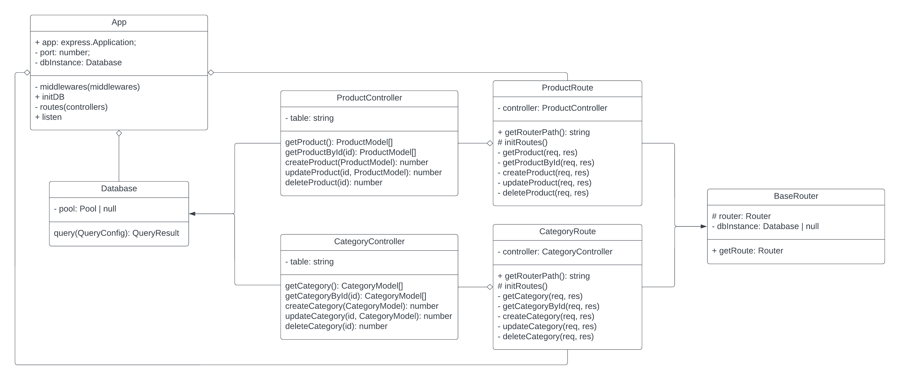

# Express with Typescript and OOP Architecture
This is a simple backend project built using the Express framework, written in Typescript, and implemented with a PostgreSQL database, following the principles of Object-Oriented Programming (OOP). I designed this OOP architecture independently without any reference from other projects, so I welcome any criticism and suggestions.

## Tech Stack
- Programming Language: [Typescript](https://www.typescriptlang.org/)
- Database: [PostgreSQL](https://www.postgresql.org/), [Node-postgres](https://node-postgres.com/), [node-pg-migrate](https://www.npmjs.com/package/node-pg-migrate)
- API Framework: [Express](https://expressjs.com/)

## Installation
- clone this repo and CD to the repo dir
- run in terminal: `npm install`
- run in terminal: `cp example.env .env`
- create database and specify the database name at PGDATABASE inside .env
- edit .env file into your postgres database
- run `npm run migrate up`
- run `npm run dev`

## Routes
- get - /categories - To get all categories
- get - /categories/:id - To get category by ID
- post - /categories - To create new category
- put - /categories/:id - To update a category by ID
- delete - /categories/:id - To delete a category by ID
- get - /products - To get all products
- get - /products/:id - To get product by ID
- post - /products - To create new product
- put - /products/:id - To update a product by ID
- delete - /products/:id - To delete a product by ID